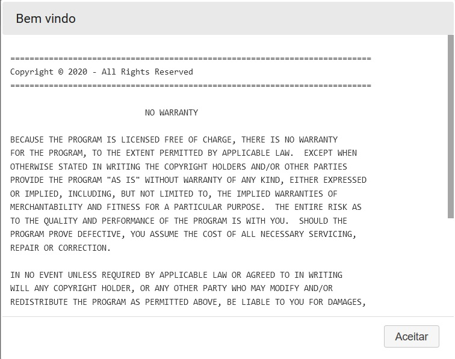
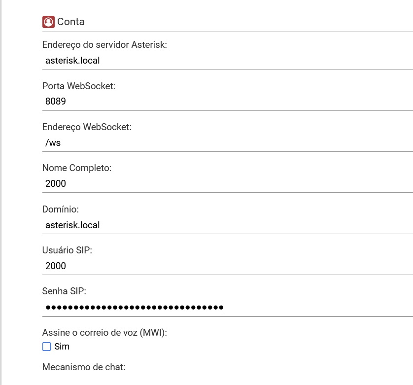

# asterisk-local

## Build and start
Requires:
 - docker
 - docker-compose

Local ip: 192.168.50.62

Domain: asterisk.local

Create "net" network
````
 docker network create --driver=bridge --subnet=172.25.0.0/16 net
````
Build Asterisk image
````
cd /opt
git clone https://github.com/primoitt83/asterisk-local.git
cd asterisk-local/build-asterisk
chmod +x build.sh
./build.sh
````

Check image:

````
docker images
REPOSITORY   TAG           IMAGE ID       CREATED              SIZE
asterisk16   latest        15e56464f06e   28 seconds ago       851MB
<none>       <none>        9619b693547d   About a minute ago   1.87GB
debian       buster-slim   794cb9f638eb   46 hours ago         69.3MB

````
Remove intermediate image:
`````
docker rmi 9619b69
`````

Start Asterisk
````
cd /opt/asterisk-local
docker-compose up -d
````

## Local tests
````
curl -k https://l72.25.0.10:8089/httpstatus

curl -k https://localhost:8089/httpstatus

curl -k https://192.168.50.62:8089/httpstatus

<html><title>Asterisk HTTP Status</title>
<body bgcolor="#ffffff">
<table bgcolor="#f1f1f1" align="center"><tr><td bgcolor="#e0e0ff" colspan="2" width="500">
<h2>&nbsp;&nbsp;Asterisk&trade; HTTP Status</h2></td></tr>
<tr><td><i>Server</i></td><td><b>Asterisk/16.27.0</b></td></tr>
<tr><td><i>Prefix</i></td><td><b></b></td></tr>
<tr><td><i>Bind Address</i></td><td><b>0.0.0.0</b></td></tr>
<tr><td><i>Bind Port</i></td><td><b>8088</b></td></tr>
<tr><td><i>SSL Bind Port</i></td><td><b>8089</b></td></tr>
<tr><td colspan="2"><hr></td></tr>
<tr><td colspan="2"><hr></td></tr>
</table><center><font size="-1"><i>Asterisk and Digium are registered trademarks of Digium, Inc.</i></font></center></body></html>
````
````
curl -k https://172.25.0.10:8089/ws

curl -k https://localhost:8089/ws

curl -k https://192.168.50.62:8089/ws

<!DOCTYPE HTML PUBLIC "-//IETF//DTD HTML 2.0//EN">
<html><head>
<title>426 Upgrade Required</title>
</head><body>
<h1>Upgrade Required</h1>
<p></p>
<hr />
<address>Asterisk/16.27.0</address>
````

## WSS Extension test

Put on your hosts file:

````
192.168.50.62	asterisk.local
````

Put on your web browser:

````
https://asterisk.local:8089/static/index.html
````



Configure the webphone like this:



